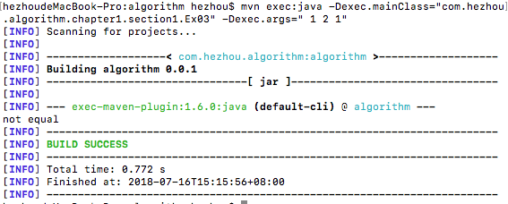

# 《算法》(第四版)

这个项目是我在阅读《算法》(第四版)一书中的积累，包括：笔记、习题解答、算法代码等。

项目使用的开发工具是 [VSCode](https://code.visualstudio.com/)，基于 [Maven](https://maven.apache.org/) 构建，关于 VSCode 如何搭建 Java 开发环境可以参考[我的个人博客](http://blog.whezh.com/vscode-java/)。

《算法》(第四版)提供了配套的[网站](https://algs4.cs.princeton.edu/home/)，网站上简要的介绍了书中的内容，提供了课后习题的解答。同时，还提供了书中的源码、工具库、测试素材等供下载使用。

>[书籍官网](https://algs4.cs.princeton.edu/home/)&ensp;[源码及资源下载](https://algs4.cs.princeton.edu/code/)

## 导入官方库

书中提供了一个[标准的输入输出库](https://introcs.cs.princeton.edu/java/stdlib/)，里面包含很多实用的方法，主要是用来生成测试素材、统计信息等，使我们能更专注的实现和测试书中的算法。

我们可以直接在项目中引入 [algs4.jar](https://algs4.cs.princeton.edu/code/algs4.jar)，这个库包含了书中的算法和标准输入输出库。

`algs4.jar` 托管在 [Bintray](https://bintray.com/algs4/maven/algs4/) 上，可以使用 Maven 或者 Gradle 导入依赖。此项目中通过 Maven 添加了依赖，`pom.xml` 中相应的配置如下：

```xml
<repositories>
  <repository>
    <id>bintray-algs4-maven</id>
    <name>bintray</name>
    <url>https://dl.bintray.com/algs4/maven</url>
  </repository>
</repositories>
<dependencies>
  <dependency>
    <groupId>edu.princeton.cs</groupId>
    <artifactId>algs4</artifactId>
    <version>1.0.3</version>
  </dependency>
</dependencies>
```

## 如何使用

### 克隆代码并编译

```bash
$ git clone https://github.com/hezhii/algorithm.git
$ cd algorithm
$ mvn compile
```

### 测试代码

可以使用 maven 运行 main class

```bash
$ mvn exec:java -Dexec.mainClass="com.hezhou.algorithm.chapter1.section1.Ex03" -Dexec.args=" 1 2 1"
```

运行结果如下：



### 笔记内容

项目以章节为单位，包含该章节中的学习笔记、习题解答以及代码。其中，笔记和习题解答等在对应章节目录下的 README 中。笔记主要通过自问自答的方式体现，记录我不懂或者记不清的问题并自己作出解答。如果某个知识点我已经掌握并清晰的记得，则不会记录到笔记中。

## 目录

- 第一章 基础
  - [1.1 基础编程模型](https://github.com/hezhii/algorithm/tree/master/src/main/java/com/hezhou/algorithm/chapter1/section1)